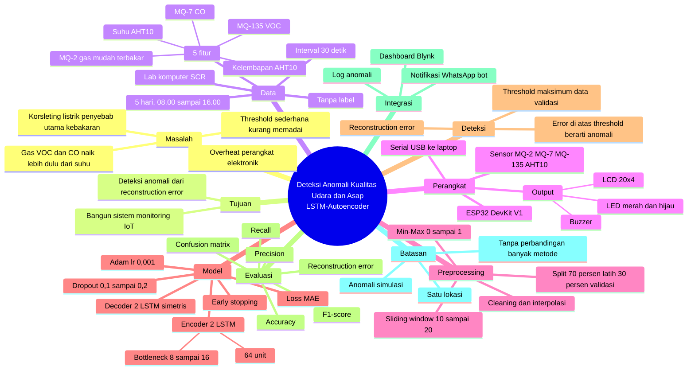
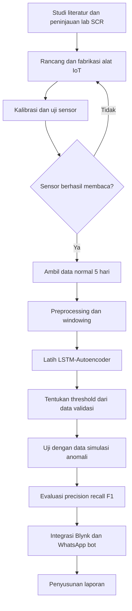

# Research Mind Map

```mermaid
mindmap
  root((Deteksi Anomali Kualitas Udara dan Asap<br/>LSTM-Autoencoder))
    Masalah
      Overheat perangkat elektronik
      Korsleting listrik penyebab utama kebakaran
      Gas VOC dan CO naik lebih dulu dari suhu
      Threshold sederhana kurang memadai
    Tujuan
      Bangun sistem monitoring IoT
      Deteksi anomali dari reconstruction error
    Data
      Lab komputer SCR
      5 hari, 08.00 sampai 16.00
      Interval 30 detik
      5 fitur
        MQ-2 gas mudah terbakar
        MQ-7 CO
        MQ-135 VOC
        Suhu AHT10
        Kelembapan AHT10
      Tanpa label
    Perangkat
      ESP32 DevKit V1
      Sensor MQ-2 MQ-7 MQ-135 AHT10
      Output
        LED merah dan hijau
        LCD 20x4
        Buzzer
      Serial USB ke laptop
    Preprocessing
      Cleaning dan interpolasi
      Min-Max 0 sampai 1
      Sliding window 10 sampai 20
      Split 70 persen latih 30 persen validasi
    Model
      Encoder 2 LSTM
        64 unit
        Bottleneck 8 sampai 16
      Decoder 2 LSTM simetris
      Dropout 0,1 sampai 0,2
      Loss MAE
      Adam lr 0,001
      Early stopping
    Deteksi
      Reconstruction error
      Threshold maksimum data validasi
      Error di atas threshold berarti anomali
    Evaluasi
      Confusion matrix
      Accuracy
      Precision
      Recall
      F1-score
      Reconstruction error
    Integrasi
      Dashboard Blynk
      Notifikasi WhatsApp bot
      Log anomali
    Batasan
      Satu lokasi
      Anomali simulasi
      Tanpa perbandingan banyak metode
```

## Alur Penelitian Ringkas

```mermaid
flowchart TD
    A[Studi literatur dan peninjauan lab SCR] --> B[Rancang dan fabrikasi alat IoT]
    B --> C[Kalibrasi dan uji sensor]
    C --> D{Sensor berhasil membaca?}
    D -- Tidak --> B
    D -- Ya --> E[Ambil data normal 5 hari]
    E --> F[Preprocessing dan windowing]
    F --> G[Latih LSTM-Autoencoder]
    G --> H[Tentukan threshold dari data validasi]
    H --> I[Uji dengan data simulasi anomali]
    I --> J[Evaluasi precision recall F1]
    J --> K[Integrasi Blynk dan WhatsApp bot]
    K --> L[Penyusunan laporan]
```
